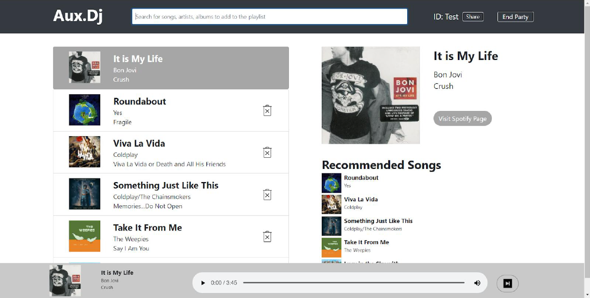

# Aux-DJ

🎧A design solution for party music streaming

👉Designed and implemented a responsive frontend interface in three weeks from initial conceptualization to launch

👉Conducted **user interviews** and **contextual inquiries** in two design iterations and prototyped our web app from a Lo-Fi paper prototype to a Mid-Fi prototype with **Balsamiq** to a Hi-Fi prototype **Figma** based on user feedback

**Team Member:** Juan Mojica, Hongmin (Andy) Zhu, The (Tay) Ngo, Jiaqi Liu

## Target user population

Our target user population would be those hosts of parties/get togethers who want to be able to queue music up with their friends/partygoers using their favorite music streaming platforms. In addition, Aux DJ wants to be able to accommodate the host’s specifications for the queue, such as the ordering of how the queue should be played (whether or not the queue should be randomized, if there is a certain sequence of songs to be played [such as the first song of each person’s requests should be played, then their second], or if there’s a voting system)

## Project concept

There does not currently exist a platform that allows hosts of parties to easily create a music queue with their partygoers, and at the same time, gives the host adequate permissions to modify the queue. In addition, the problem that these users currently face is that there is no application that integrates with their favorite music streaming service (Spotify, Soundcloud, etc.) that allows for their friends to be able to add their music to the host’s queue straight from their playlists. Our current design solution revolves around a
web application where the host of a party is able to generate a key to distribute to the partygoers. These partygoers are then able to join a music room where they can add music from their favorite platforms, such as Spotify. Simultaneously, the host has elevated privilege compared to the user, where the host can set what ordering the queue will be played

## Design Process

We followed the design process to do every step for this project:

- Brainstormed the ideas and draw storyboards

- Comparative Analyzed existing platforms and thought about the design risks and implementation risks

- Designed backend architecture

- prototyped frontend design (first iteration):

  - interactive paper prototype and user interviews

  - Mid-Fi prototype with Balsamiq and user interviews

  - meet up with IA and get feedback

- prototyped frontend design (second iteration):

    - Hi-Fi prototype Figma and user interviews
    - meet up with IA and get feedback
    - implement frontend with HTML, CSS, jQuery

## Frontend Screenshots

Figure 1: login page (login with Spotify)

Figure 2: room page (host's perspective)

Figure 3: room page (guest's perspective)

## License

MIT License